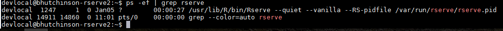

# Setting Up Ubuntu 16.04 to Start RServe On Boot

## Introduction

If you have successfully installed R and Rservice on an Ubuntu server and can connect from Tableau clients you will want to automate the startup of RServe and keep it running with minimal intervention. to automate the startup of RServe we will use systemd.

## Quick Introduction to systemd

Ubuntu has several ways to manage services that run in the background and at startup. Recent versions of Ubuntu use systemd (see [wikipedia](https://en.wikipedia.org/wiki/Systemd) and [systemd homepage](https://www.freedesktop.org/wiki/Software/systemd/)) but earlier distributions used different mechanisms like [upstart](https://en.wikipedia.org/wiki/Upstart) or [init](https://en.wikipedia.org/wiki/Init).

These instructions assume we are using systemd and are derived from a post found on the [github repository for rserve](https://github.com/s-u/Rserve/issues/56). The sample provided in this issue did not work out of the box but I was able to modify it for our install that uses Ubuntu on OpenStack.

## Describing the Unit File
systemd uses a unit file to describe services and I have created a file called **rserve.service**

I will explain what each section does in case you need to change this for other services or servers (AWS for example)

information on systemd unit files can be found here: [Understanding Systemd Units and Unit Files](https://www.digitalocean.com/community/tutorials/understanding-systemd-units-and-unit-files)

Here is the complete file (Note that **#** is a comment and the file is broken out into sections denoted by a section header in square brackets **[]**):

```
[Unit]
Description=Rserve

[Service]
TimeoutSec=10s
Type=forking
PIDFile=/var/run/rserve/rserve.pid

# Run ExecStartPre with root-permissions
#PermissionsStartOnly=true
#ExecStartPre=/bin/mkdir -p /var/run/rserve
#ExecStartPre=/bin/chown -R nobody:nobody /var/run/rserve

# Define runtime directory
RuntimeDirectory=rserve
RuntimeDirectoryMode=750

# Run ExecStart with User=devlocal / Group=devlocal
# Robin Cottiss-  nobody might work if nobody has permission to run R
User=devlocal
Group=devlocal
ExecStart=/usr/bin/R CMD Rserve --quiet --vanilla --RS-pidfile /var/run/rserve/rserve.pid

[Install]
WantedBy=multi-user.target
```

Let's look at the settings in detail:

### [Unit]

gives the service a name. We will use this in any enable, start and stop commands. We will call ours Rserve.

```
[Unit]
Description=Rserve
```
### [Service]

This is the guts of a systemd service file. The file found on the internet had settings for some commands to run to help set up the service but they did not work as expected on our system so I found a different way to acheive the setup. The setup that is required to store the Process ID (pid) of the Rserve daemon so systemd can manage it. This is important and we need to get the pid becuase of the way we start rserve by launchine R that has a command to spawn rserve into its own daemon process. If we were starting a service that did not spawn a daemon the service file might be simpler.

Going through the section line by line:

```
TimeoutSec=10s
```

Giving a timeout value of 10 seconds tell systemd that we expoet the server to startup well within that time. If the service has not started up in the allouted time systemd will return with a failure code.

```
Type=forking
```
Because we start Rserve by running R with a command to start rserve and rserve is a separate process we are creating a forking type service. There may be other ways to start rserve as a systemd service but this seems to work when we are starting via an R CMD. If the type is forking we need to do a bit of work to get the PID and that is what we do with the next few commands

```
PIDFile=/var/run/rserve/rserve.pid
```

This tells systemd that we will be storing the PID file in the folder /var/run/rserve and calling it rserve.pid. the folder /var/run already exists (it's a link to another folder called /run but /var/run as a standard system folder. You can get more details here: [Filesystem Hierarchy Standard](http://www.pathname.com/fhs/2.2/fhs-5.13.html))

Forget these commented out commands. They come from the original file found on the internet and did not work. I believe the alternative method I found is better anyway
```
# Run ExecStartPre with root-permissions
#PermissionsStartOnly=true
#ExecStartPre=/bin/mkdir -p /var/run/rserve
#ExecStartPre=/bin/chown -R nobody:nobody /var/run/rserve
```
Next we tell systemd that we want a directory called rserve to be created with mode 750. by default systemd will create this folder in /var/run. I am not sure if this is the best mode but we can revist this later. One reson for having a different mode is to make the service more secure.
```
# Define runtime directory
RuntimeDirectory=rserve
RuntimeDirectoryMode=750
```
Now we can tell systemd the user and group context that our daemon will run under. This should be a user and group with the least privileges necessry to run the service. The original servie description used the special user nobody:nobody but this did not work so I am using devlocal:devlocal which is the default admin user on our OpenStack environment. This is not the best user as it probably has more privileges than necessary which creates a security risk but given that this is an internal service right noew we have less of a concern. If we were to deploy this service on AWS security would be a paramount concern.

We define the user and the group.

```
# Run ExecStart with User=devlocal / Group=devlocal
# Robin Cottiss-  nobody might work if nobody has permission to run R
User=devlocal
Group=devlocal
```
Then we define the actual command to start rserve using the ExecStart setting. This command is very similar to the one we used manually to start the rserve deamon with some extra options to make it a well behave daemon. We also need to tell rserve to store its pidfile in the same location that our systemd service is expecting to find the pidfile. Remember the pidfile is going to hold the PID of the running rservice process.
```
ExecStart=/usr/bin/R CMD Rserve --quiet --vanilla --RS-pidfile /var/run/rserve/rserve.pid
```

Note that you can see the pid of the daemon after it's started by running the following back command

```bash
ps-ef | grep rserve
```

### [Install]

Finally we give systemd some information about when to run this service if we want enable it on boot. Simply put this tells systemd that we want to run rserve when the system is ready for users to login and connect over the network.

```
[Install]
WantedBy=multi-user.target
```
Next, let's see where we need to put this file, enable the service to start on boot and some testing to make sure it's working as expected.

## Configure systemd to Start RServe on System Start
 Assuming you have the rserve.service file in your current directory, we need to copy it to /etc/systemd/system
``` bash
sudo cp rserve.service /etc/systemd/system
```
We can then make sure the file is registered properl. This might only be important if you edit the file to make changes but it's a good practice.

``` bash
sudo systemctl daemon-reload
```
Next, test the service. This assumes that there is no other rserve daemon running from a previous manual test. Once we get this working we should always use systemd to manage our service and that inludes stopping and restarting the service, but for now kill any manual rserve daemons running.

``` bash
kill -9 <pid>
```

Now start the rserve daemon using the systemd command **systemctl** which stands for system control.
``` bash
sudo systemctl start rserve
```

If you did not get any errors you can test to see if the service is running using ps- ef.

``` grep
ps -ef | grep rserve
```

You should see something like this:


You can also check to see if the pid file exists
``` bash
ls -al /var/run/rserve
```
you should see something like this:


If everything is working OK you can now enable this service to start on system restart.
``` bash
sudo systemctl enable rserve.service
```

You will get some feedback like this:


```
Created symlink from /etc/systemd/system/multi-user.target.wants/rserve.service to /etc/systemd/system/rserve.service.
devlocal@bhutchinson-rserve2:~$
```
To test this you should reboot the system and confirm that rserve is running right after startup.

```
sudo reboot
```

Once you have a working service you can check if the service is running with the following command:

``` bash
sudo systemctl status rserve.service
```

You will get this back:


You might want to stop or restart the service. For example, after adding a new package or changing the systemd service itself. Here are the commands to stop, start or restart the service:

```bash
sudo systemctl stop rserve
```
``` bash
sudo systemctl start rserve
```
``` bash
sudo systemctl restart rserve
```

One added benefit of creating this as a systemd service is that the service should restart if the daemon process dies but there could still be other problems that could force a restart of the service or even the server. We will need to monitor the system to make sure it is available whenever the field needs it.

## Summary

You should now have a working Rserve server that is available to users. All they need to know is the IP address of the server, its port and any packages that are loaded by default.
